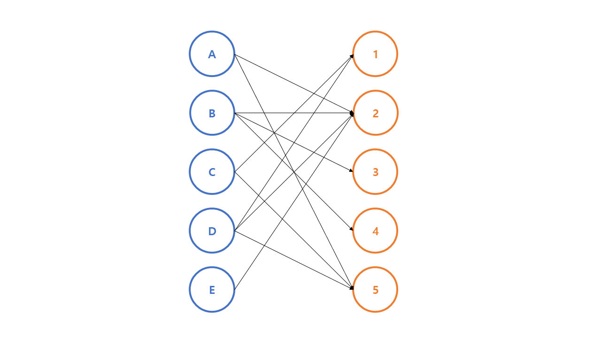
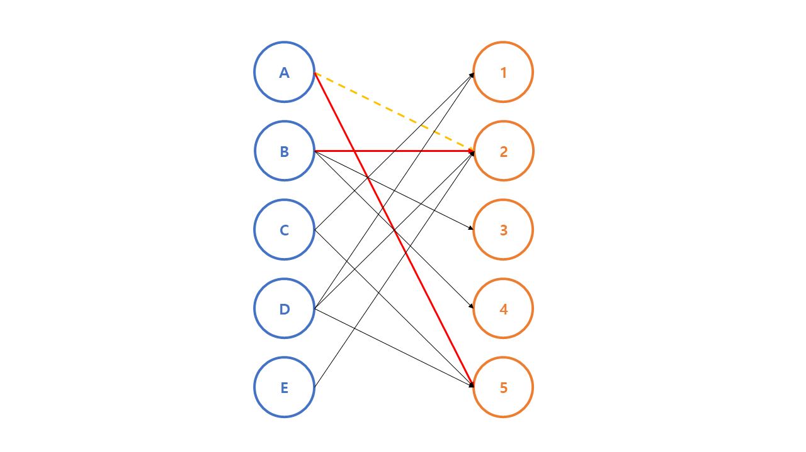
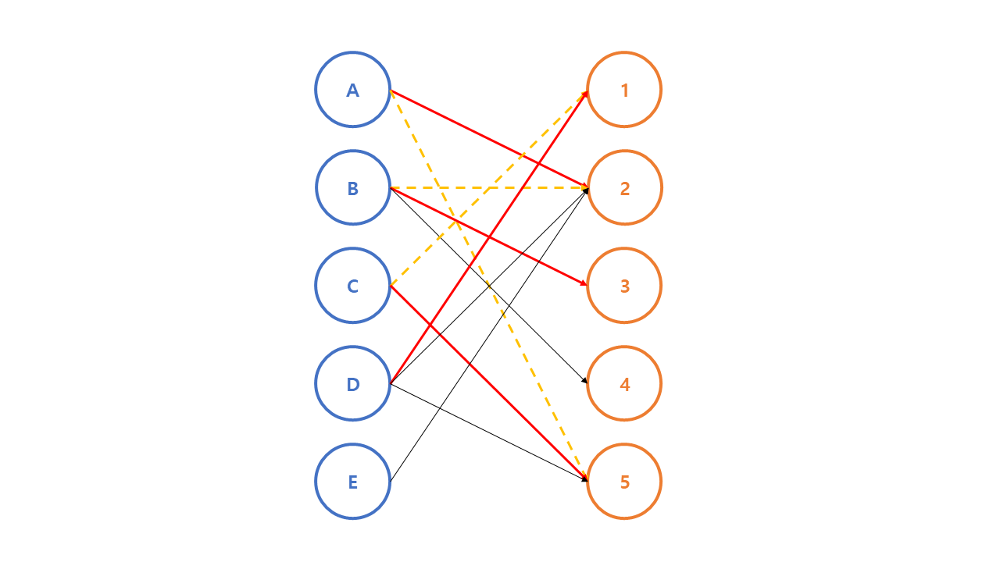

# 이분 매칭 (Bipartite Matching)

## 이분 매칭 과정



정점을 두 개의 그룹으로 나누었을 때, 존재하는 모든 간선의 양 끝 정점이 서로 다른 그룹에 속하는 형태의 그래프를 **이분 그래프(bipartite graph)** 라고 한다.  
이분 그래프에서 한쪽 그룹을 A, 다른 쪽 그룹을 B라고 하자. A, B 그룹 사이 간선의 방향이 모두 A -> B일 때, 최대 유량을 구하는 문제를 **이분 매칭(bipartite matching)** 문제라고 한다.  
여기서 이분 매칭 문제의 답은 이분 그래프에서 매칭의 최대 개수와 같다. 이를 최대 매칭(maximum matching)이라고 칭하기도 한다.  
매칭은 간선 하나를 선택하는 것인데, 이때 간선을 선택하면서 양 끝 정점도 같이 선택하고 각 정점은 한 번만 선택될 수 있다.  
O(VE) 시간으로 최대 매칭 개수를 구하는 최적화가 존재한다. 이 때, V는 양쪽 그룹 중 큰 쪽의 크기이다.

A 그룹의 정점을 순서대로 살펴보며 간선으로 연결된 B 그룹의 정점 중 매칭이 안 된 정점이 있으면 매칭을 한다.


처음엔 A-2 매칭이 바로 이어진다.



B와 연결된 정점은 2, 3, 4인데, 그 중 2는 A와 매칭된 상태이다.  
A는 2 대신 5와 매칭이 가능하므로, A-2 매칭이 취소되고 A-5, B-2 매칭이 생성된다.


C-1 매칭이 생성된다.



D-1 매칭이 생성된다.  
C-1 매칭은 소거되고 C-5 매칭이 생성된다.  
A-5 매칭은 소거된고 A-2 매칭이 생성된다.  
B-2 매칭은 소거되고 B-3 매칭이 생성된다.

E의 경우, 매칭을 만들 수가 없다.  
유일한 인접 정점이 2이므로, E-2가 생성되면,  
2와 매칭되어 있던 A를 5와 매칭시키고,  
5와 매칭되어 있던 C를 1과 매칭시키고,  
1과 매칭되어 있던 D를 2 또는 5와 매칭시켜야 하는데,  
2는 이번 단계에서 이미 E와 매칭되어 있고, 5 역시 이미 A와 매칭되어 있으므로 더 이상 매칭시킬 수 없다.  
따라서 dead end가 발생하고 새로운 매칭을 형성할 수 없다.

이렇게 최대 매칭은 4이다.

<br>

## C++ Code

```cpp
// N - A 그룹 크기
// M - B 그룹 크기
// A[i], B[i] - 각 정점에 매칭된 반대편 정점 번호
int N, M, A[MAX], B[MAX];
// graph[i] - A[i]와 간선으로 연결된 B의 정점들
vector<int> graph[MAX];
// visited[i] - 원래 매칭되어 있던 정점을 수정할 때, 방문한 A의 정점들
bool visited[MAX];

// A 그룹에 속한 정점 a를 매칭시키면 true
bool dfs(int a) {
    visited[a] = true;

    for(int b: graph[a]) {
        // 반대편이 매칭되지 않았거나
        // 매칭되어 있었지만 원래 매칭되어 있던 A의 정점을 다른 B의 정점과 매칭시킬 수 있으면 성공
        if(B[b] == -1 || (!visited[B[b]] && dfs(B[b]))) {
            A[a] = b;
            B[b] = a;
            return true;
        }
    }
    return false;
}

int main(void) {
    ...

    int match = 0;
    // 초기값 -1
    fill(A, A + N, -1);
    fill(B, B + M, -1);

    for(int i = 0; i < N; i++) {
        // 아직 매칭되지 않은 그룹 A의 정점에 대해 매칭 시도
        if(A[i] == -1) {
            // visited 배열 초기화
            fill(visited, visited + N, false);

            if(dfs(i)) match++;
        }
    }

    printf("%d\n", match);
}
```
